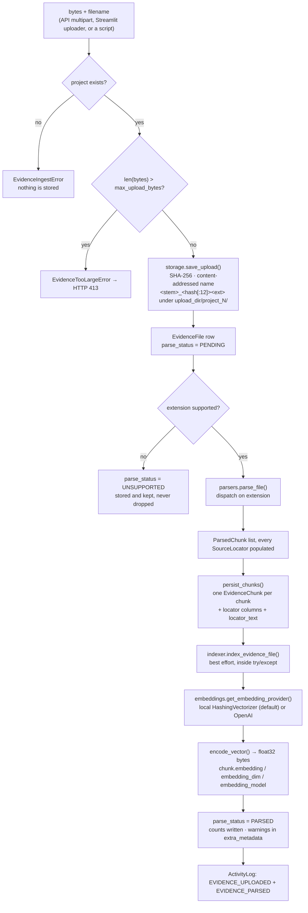
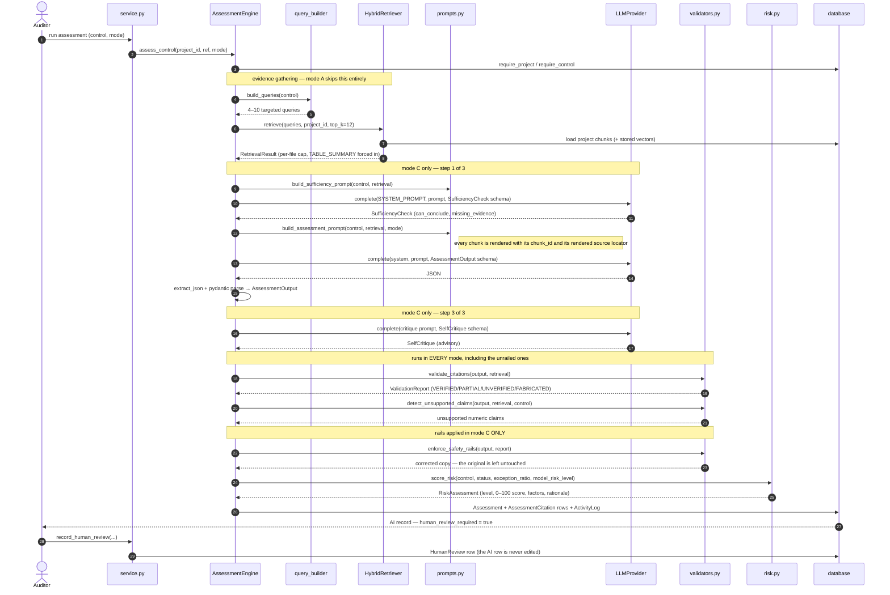

# Architecture

**LLM-Assisted IT Audit Risk and Control Assessment System** — a university research prototype.

This document describes the system **as it is implemented**, not as it might be. Where a component
is weaker than its name suggests, or where a guarantee has a boundary, that is stated in place
rather than left to be discovered. Line numbers and behaviours below were checked against the code
in this repository; the runs quoted in [Section 5](#5-the-three-experimental-conditions) were
executed with `LLM_PROVIDER=mock` on `DATASET-001` and are reproducible.

**Contents**

1. [What the system is, and the claim it makes](#1-what-the-system-is-and-the-claim-it-makes)
2. [Layer map, and why each boundary exists](#2-layer-map-and-why-each-boundary-exists)
3. [Path 1 — evidence ingestion](#3-path-1--evidence-ingestion)
4. [Path 2 — control assessment](#4-path-2--control-assessment)
5. [The three experimental conditions](#5-the-three-experimental-conditions)
6. [The provider abstraction, and substituting a local model](#6-the-provider-abstraction-and-substituting-a-local-model)
7. [Design decisions worth defending](#7-design-decisions-worth-defending)
8. [Known architectural limitations](#8-known-architectural-limitations)

---

## 1. What the system is, and the claim it makes

An auditor uploads evidence (policies, configuration exports, user listings, ticket exports). The
system retrieves the fragments relevant to one IT control, asks a language model to assess that
control against those fragments, **mechanically re-checks every citation the model produced against
the text it was actually shown**, computes a risk band from a published deterministic formula, and
stores the result as an *AI record* that a human auditor must review. The auditor's decision is a
**separate row** that never overwrites the AI's.

The claim the architecture is built to support is narrow and worth stating precisely:

> Every sentence the system presents as evidential can be traced to a stored chunk of a stored file,
> and whether the quoted characters actually occur in that chunk is decided by a reproducible
> mechanical check rather than by trusting the model.

Everything else — that the quote *supports* the conclusion, that the evidence is authentic, that the
population is complete — is explicitly outside what the system can establish, and the report says so
in its Limitations section (`app/audit/report.py`, section 10).

Two properties fall out of the research design rather than out of engineering taste:

- **The system must run fully offline.** `LLM_PROVIDER=mock` selects `MockLLMProvider`, a
  deterministic rule-based stand-in with no network access. Results obtained that way measure the
  *pipeline*, never a language model's capability. The mock's own docstring says this, `/health`
  reports which provider answered, and every generated report prints it.
- **The system must be able to say "I cannot tell."** `INSUFFICIENT_EVIDENCE` is a first-class
  member of `AssessmentStatus`, not an error path. See [§7.1](#71-why-insufficient_evidence-is-a-first-class-outcome).

---

## 2. Layer map, and why each boundary exists

```
┌────────────────────────────────────────────────────────────────────────────────────┐
│  ENTRY POINTS                                                                      │
│  run.py  ·  app/api/main.py (FastAPI)  ·  app/frontend/streamlit_app.py            │
└───────────────┬──────────────────────────────────────────┬─────────────────────────┘
                │                                          │
    ┌───────────▼────────────┐                 ┌───────────▼────────────────┐
    │ app/api/routers/*      │                 │ app/frontend/pages/*       │
    │ 9 routers, no ORM code │                 │ 10 pages, no ORM code      │
    │ Pydantic in/out only   │                 │ via data_access facade     │
    └───────────┬────────────┘                 └───────────┬────────────────┘
                │              both front ends             │
                └──────────────────┬───────────────────────┘
                                   ▼
        ┌──────────────────────────────────────────────────────────────┐
        │  app/audit/service.py — the shared data-access layer          │
        │  47 public functions. Imports no FastAPI, no Streamlit.        │
        │  Mutating functions commit; reads never do.                   │
        └───────────────┬──────────────────────────────┬────────────────┘
                        │                              │
      ┌─────────────────▼──────────────┐  ┌────────────▼──────────────────────────┐
      │  app/audit/engine.py            │  │  app/audit/report.py                  │
      │  the orchestrator: modes A/B/C  │  │  10-section report, 2 renderers       │
      └───┬──────────┬──────────┬───────┘  └───────────────────────────────────────┘
          │          │          │
  ┌───────▼───┐ ┌────▼─────┐ ┌──▼────────────┐ ┌────────────────┐ ┌───────────────┐
  │ app/rag   │ │ app/llm  │ │ app/audit/    │ │ app/audit/     │ │ app/evidence  │
  │ retrieval │ │ providers│ │ validators.py │ │ risk.py        │ │ parse/store   │
  │ BaseRetr. │ │ LLMProv. │ │ grounding +   │ │ deterministic  │ │ locators      │
  │ (ABC)     │ │ (ABC)    │ │ safety rails  │ │ risk model     │ │               │
  └───────┬───┘ └────┬─────┘ └───────┬───────┘ └───────┬────────┘ └───────┬───────┘
          └──────────┴───────────────┴─────────────────┴──────────────────┘
                                     ▼
        ┌──────────────────────────────────────────────────────────────┐
        │  FOUNDATION (imported by everything, imports nothing above)   │
        │  app/config.py · app/schemas/{enums,assessment}.py            │
        │  app/database/{base,models,seed}.py · app/rag/base.py         │
        │  app/llm/base.py                                              │
        └──────────────────────────────────────────────────────────────┘

        app/evaluation/{datasets,generator,metrics,runner}.py
        sits beside the engine and drives it; nothing in the
        production path imports it.
```

### Why each boundary exists

| Boundary | Enforced by | Why it is there |
|---|---|---|
| Routers and pages hold **no ORM code** | `app/audit/service.py` is the only module either imports for data; its hand-maintained `__all__` deliberately excludes the SQLAlchemy names it imports (`select`, `func`, `joinedload`, `selectinload`) | Two front ends over one database is the fastest way to end up with two subtly different applications. Every filter, every count and every commit boundary is defined once. |
| The engine depends on **interfaces**, not implementations | `LLMProvider` (`app/llm/base.py`) and `BaseRetriever` (`app/rag/base.py`), both ABCs; `AssessmentEngine.__init__` accepts `llm=` and `retriever=` overrides | Swapping the mock for a hosted model, or keyword retrieval for hybrid, is a configuration change. It is also what makes the engine testable: `tests/conftest.py` injects `BrokenLLM` and `ScriptedLLM` to reproduce provider failure and specific model misbehaviour exactly. |
| Parsing is separate from **indexing** | `app/evidence/parsers.py` decides what a citable unit is; `app/rag/indexer.py` decides how it is found again | The embedding provider or dimension can change without re-uploading or re-parsing a single file — `reindex_project()` simply rewrites the vectors. |
| Validation is separate from **generation** | `app/audit/validators.py` takes an `AssessmentOutput` and a `RetrievalResult` and asks the model nothing | If the model were consulted about its own grounding, the hallucination rate would be a claim rather than a measurement. Every verdict here is reproducible from the stored assessment and the stored chunks. |
| Risk is separate from **the model** | `app/audit/risk.py` computes from five named factors with published weights | A number a model emits cannot be recomputed or argued with. See [§7.4](#74-why-risk-is-computed-not-asked-for). |
| Rendering is separate from **persistence** | `build_report_data()` is the only report function that touches the database; `render_markdown()` / `render_html()` are pure | A rendered report cannot change under a lazy load, and what was rendered is exactly what the summary statistics were computed from. |
| The evaluation harness never contaminates operational figures | Every harness assessment carries `Assessment.evaluation_run_id`; `dashboard_stats()` and `list_findings()` filter it out by default | Research runs are not fieldwork. (One incomplete case is recorded in [§8](#8-known-architectural-limitations).) |

### Module inventory

| Package | Modules | Responsibility |
|---|---|---|
| `app/config.py` | 1 | `Settings` (pydantic-settings), `get_settings()` (LRU-cached), `reload_settings()`, `redacted_dict()`. No secret is ever hard-coded. |
| `app/schemas/` | `enums.py`, `assessment.py`, `api.py` | The status/risk vocabulary; the `AssessmentOutput` contract the model must satisfy; the HTTP request/response models. |
| `app/database/` | `base.py`, `models.py`, `seed.py` | Engine + session factory, 12 ORM tables, idempotent control-library seeding. |
| `app/evidence/` | `parsers.py`, `chunking.py`, `storage.py`, `service.py` | Bytes in, citable and retrievable chunks out. |
| `app/rag/` | `base.py`, `embeddings.py`, `indexer.py`, `query_builder.py`, `retriever.py` | Query expansion, BM25 / cosine / RRF-hybrid retrieval, local hashing embeddings. |
| `app/llm/` | `base.py`, `mock_provider.py`, `openai_provider.py`, `factory.py` | The provider interface and its two implementations. |
| `app/audit/` | `prompts.py`, `engine.py`, `validators.py`, `risk.py`, `report.py`, `service.py` | The audit brain and the shared data layer. |
| `app/evaluation/` | `datasets.py`, `generator.py`, `metrics.py`, `runner.py` | Six synthetic datasets with known ground truth, the metric definitions, the experiment procedure. |
| `app/api/` | `main.py` + 9 routers | The HTTP surface. See `docs/API.md`. |
| `app/frontend/` | shell, theme, components, `data_access.py`, 10 pages | The Streamlit audit console. |

---

## 3. Path 1 — evidence ingestion

One function owns this path: `app.evidence.service.ingest_file(session, project_id, data, filename,
evidence_type, description, uploaded_by, is_synthetic=False) -> EvidenceFile`.



### What each step guarantees

**Storage (`app/evidence/storage.py`).** The uploaded filename is never used as a path component:
`safe_filename()` reduces it to a leaf (`../../etc/passwd` → `passwd`) and the stored name is
`<stem>_<first 12 hex of SHA-256><ext>`. Two uploads of identical bytes collapse onto one file; two
different files sharing a name cannot overwrite each other. The SHA-256 is stored on the row and is
the only integrity claim the system makes — `verify_stored()` exists so that claim can be
demonstrated rather than asserted. The auditor's original filename is kept on the row and is what
appears in citations.

**Parsing (`app/evidence/parsers.py`, 1 199 lines).** Dispatch is by extension: `.pdf` (pypdf, per
page with section detection), `.docx` (python-docx, paragraphs with heading tracking, plus tables),
`.csv`/`.xlsx`/`.xls` (pandas/openpyxl), `.txt`/`.md`/`.json`. Two conventions are load-bearing:

- **Row numbers are 1-based spreadsheet rows as a human sees them.** Header on row 1, first data
  record on row 2. When a citation says row 14, opening the file at row 14 must show that record.
  For CSV this counts *records*, so a quoted field containing newlines still maps to the row Excel
  would display. `tests/test_parsers.py` asserts this against a fixture with exceptions planted at
  rows 7, 14, 23, 38 and 45.
- **Every tabular sheet also emits exactly one `TABLE_SUMMARY` chunk** describing the whole
  population: shape, dtypes, null counts, per-value counts for low-cardinality columns, and the
  source rows for rare values. This is what lets a model state "10 of 100 accounts show
  MFA_Status = Disabled, at rows 14, 22, 31…" without being shown all 100 rows — and what stops it
  guessing instead.

Parsing never raises on bad input. An encrypted PDF, an empty sheet, a ragged CSV, a zero-byte
upload and a binary file behind a `.txt` extension each produce a clean `ParseResult` carrying a
warning. A tool that crashes on a strange file teaches its user to work around it rather than record
it.

**Chunking (`app/evidence/chunking.py`).** All size and split decisions live in one module so a
policy sentence is equally retrievable from a `.docx` and a `.pdf`. Splitting is expressed over
`TextBlock` objects that already carry their provenance, so a packed chunk still knows exactly which
part of the source it covers. Defaults: `chunk_size=1200`, `chunk_overlap=180`,
`table_rows_per_chunk=25`.

**Indexing (`app/rag/indexer.py`).** Deliberately best-effort: the import of the RAG layer is
*inside* the function, and any failure is downgraded to a warning on the row rather than losing the
upload. Keyword retrieval still works without vectors. The default embedding provider
(`LocalHashingEmbedding`) is scikit-learn's `HashingVectorizer` — stateless, so there is no fitted
vocabulary to keep in sync and a chunk embedded today stays comparable with a query embedded weeks
later in another process. Vectors are float32 in a `LargeBinary` column.

**Observed, on `DATASET-001` through the HTTP API:** the policy `.docx` → 5 chunks, all
`DOCX_PARAGRAPH`, 5 embedded; the 100-row `.csv` → 5 chunks (4 × `TABLE_ROWS`, 1 × `TABLE_SUMMARY`),
5 embedded.

---

## 4. Path 2 — control assessment

The orchestrator is `app.audit.engine.AssessmentEngine.assess_control(project_id,
control_id_or_ref, mode=ExperimentMode.C_RAG_WORKFLOW, persist=True, evaluation_run_id=None)`. It
raises only when the *request* is invalid (unknown project or control) — there is then nothing to
attach a result to. Every failure after that point becomes a persisted `Assessment` row carrying the
error, because an audit run that quietly loses a control is worse than one that records a failure an
auditor can see.



### Step detail

**4.1 Query construction (`app/rag/query_builder.py`).** A control is not one question. "Privileged
accounts are protected by MFA" asks at least three separable things: what the *policy* requires, what
the *configuration* shows, and which *accounts* are exceptions. One concatenated query retrieves
whatever is longest and most keyword-dense — in audit evidence, always the user listing rather than
the policy. So each control is expanded into 4–10 queries (`MIN_QUERIES=4`, `MAX_QUERIES=10`,
`MAX_QUERY_CHARS=280`), including one *deliberately negative* angle
(`"{name} exceptions non-compliant disabled failed missing not approved"`) because every query
derived from a control's own wording is a better match for a compliant row than for a failing one —
and the failing rows are the point of the test. Expansion is mechanical, with no LLM call, so it
stays cheap, offline and reproducible.

**4.2 Retrieval (`app/rag/retriever.py`).** Three interchangeable strategies:
`KeywordRetriever` (BM25 implemented in-repo, `k1=1.5`, `b=0.75`, so the ranking function is
inspectable rather than hidden in a dependency), `VectorRetriever` (cosine over stored vectors) and
`HybridRetriever` (reciprocal-rank fusion, `k=60`, Cormack et al. 2009). What matters more than the
scoring is what happens after it, because audit evidence is pathologically unbalanced:

- **A per-file cap of `max(2, top_k // 2)`**, backfilled if the cap would under-fill the budget, so
  a 100-row export cannot crowd out the one-paragraph policy that states the requirement.
- **Mandatory table summaries**: if any row-level chunk of a file is retrieved, that file's
  `TABLE_SUMMARY` chunk is retrieved too, *on top of* `top_k` rather than displacing an exception
  row. Ten exceptions mean something very different in a population of 20 than in one of 10 000.

Scores are reported honestly rather than made to look uniform: cosine is absolute in [0, 1]; the
summed BM25 score has no natural bound and is normalised against the best chunk of that retrieval
(raw sum kept in `extra_metadata['bm25_score']`); the fused score is the raw reciprocal-rank sum,
whose maximum is `2/(k+1)`. `min_score` is therefore compared against the *component* score in each
strategy, never against the fused value.

**4.3 Prompt construction (`app/audit/prompts.py`, `PROMPT_VERSION = "1.0.0"`).** `SYSTEM_PROMPT`
states the four-way rule in words — REQUIRES / PROVES / INFERS / HUMAN-VERIFIES — with hard rules
("never invent evidence", "never cite a chunk_id that was not supplied", "quote verbatim or not at
all", "you are not authorised to state that an organisation is compliant with any law, regulation,
standard or framework"), the status vocabulary, and a worked example of the case that fails most
often: a privileged-account listing with no MFA column, where the correct answer is
`INSUFFICIENT_EVIDENCE` and the three tempting wrong answers are spelled out and refuted.
`render_evidence_block()` prints each chunk as `[chunk_id: N] SOURCE: <locator>` followed by its
text; `TABLE_SUMMARY` chunks are never truncated (`PROTECTED_SOURCE_TYPES`), and a chunk that would
be cut below `MIN_CHUNK_TEXT_CHARS=240` is dropped with a note instead of kept as a misleading stub.
`prompt_metadata()` publishes a fingerprint so a result set can be pinned to the exact wording that
produced it.

**4.4 The provider call (`AssessmentEngine._complete`).** One `LLMProvider.complete()` call, timed
with `time.perf_counter()` *around* the call — retries and client-side backoff are part of what a
user waits for and are not excluded from the latency measurement. Every exception becomes
`StepTelemetry(ok=False, error=...)` rather than propagating. The provider also receives an
`LLMCallContext` carrying the control payload, the chunk list and `extras` including
`retrieval_performed` and `evidence_chunks_supplied`, so a provider can distinguish "this mode
retrieves nothing" from "retrieval ran and found nothing" — two situations that look identical from
an empty chunk list and warrant opposite behaviour.

**4.5 Schema validation.** `extract_json()` (`app/llm/base.py`) recovers a JSON object from fenced,
prose-wrapped, trailing-comma or smart-quoted output before pydantic parses it into
`AssessmentOutput`. The model schema is tolerant by design: an unmappable status degrades to
`INSUFFICIENT_EVIDENCE` rather than raising, a bare string in `evidence[]` is kept as an unlocated
quote so the validator can judge it rather than silently dropping a real quotation, and
`human_review_required` has a `mode="before"` validator that returns `True` unconditionally.

**4.6 Citation validation (`app/audit/validators.py`).** For each citation:

| Verdict | Condition |
|---|---|
| `FABRICATED` | The `chunk_id` is not in the retrieved set (the quote is **not even scored** — plausibility is the failure mode being guarded against), or the chunk is real but the quote scores below half the threshold. |
| `VERIFIED` | Quote matches its own chunk at ≥ `settings.citation_match_threshold` (default 0.6). |
| `PARTIAL` | Matches at ≥ half the threshold; or the quote is verifiable but **no `chunk_id` was supplied**, because an untraceable citation can never be fully verified even when its text is genuine. |
| `UNVERIFIED` | A resolvable `chunk_id` with no quotation. Honest, but earns no grounding credit. |

The similarity score is `max(longest_common_substring_ratio, token_overlap_ratio)` over
normalised text. `detect_unsupported_claims()` separately scans `assessment`, `finding` and
`reasoning` for numbers that appear nowhere in the retrieved evidence, masking identifiers
(`CONTROL-001`), cross-references ("section 4.2"), ordinals, list markers, row locators and dates
first, and accepting a percentage that is derivable from two evidence counts ("10 of 100 failed" and
"90% complied" are one observation stated twice).

Three rates are reported side by side and all three are stored:
`grounding_rate = (verified + 0.5·partial)/total`, `grounding_rate_strict = verified/total`, and
`partial_credit_rate`. **`grounding_rate_strict` is the figure to quote in a write-up** — it rests
on the threshold alone and on no weighting choice.

**4.7 Safety rails (`enforce_safety_rails`, mode C only).** Returns a corrected *copy*; the model's
unedited answer survives as the audit trail. In order:

1. An `EFFECTIVE` or `NOT_EFFECTIVE` conclusion with **zero verified citations** is downgraded to
   `INSUFFICIENT_EVIDENCE`. Both directions are covered: an unsupported clean opinion and an
   unsupported accusation are equally unsafe. `POTENTIAL_DEFICIENCY` is deliberately left alone — it
   already asserts only a possibility, and suppressing a hedged flag would hide the signal an
   auditor most needs.
2. Fabricated citations and unsupported figures are **kept, flagged and pushed into
   `human_verification_required`**, never edited out.
3. If nothing was cited at all, `NO_EVIDENCE_SENTINEL` is written into the assessment and finding
   text so silence cannot read as a clean result.
4. `human_review_required = True`, unconditionally.

Before those rails, mode C applies two workflow corrections of its own
(`_apply_workflow_corrections`): if retrieval returned **no chunks**, any asserting status is
withdrawn (unsupported by construction, not by degree); and a self-critique downgrade is applied
**only when the mechanical validator independently agrees** the conclusion was ungrounded —
requiring both stops a model talking itself out of a correct, well-cited finding.

**4.8 Risk scoring (`app/audit/risk.py`).** Five factors on a 1–5 ladder, weighted
`control_failure_severity 0.30 · likelihood 0.25 · impact 0.20 · privilege_level 0.15 ·
data_sensitivity 0.10`, to a 0–100 score with bands `LOW ≥ 0 · MEDIUM ≥ 25 · HIGH ≥ 50 ·
CRITICAL ≥ 75`. Two named adjustments make the additive model defensible: an `EFFECTIVE` ceiling
(residual risk attributable to a control that tested effective is reported LOW, with the exposure
factors still printed) and an `INSUFFICIENT_EVIDENCE` floor at the MEDIUM threshold — otherwise an
unknown control over a low-sensitivity system would be reported LOW, rewarding the system for an
uninformative answer. The model's own suggested band may escalate the computed one by **exactly one
band** and can never lower it; a disagreement it cannot apply is recorded for the reviewer. Every
artefact carries `RISK_MODEL_LABEL` — *"Prototype research risk scoring model - not an official
industry framework."*

**4.9 Persistence.** One `Assessment` row (with `human_review_required=True` written from the engine,
not from the model's answer), one `AssessmentCitation` row per citation (a `chunk_id` that does not
resolve is stored as `NULL` — that NULL *is* the fabrication signal downstream, and is also the only
way to persist the row at all, since the column is a foreign key), and one `ActivityLog` row with
`actor_type="AI"`.

**4.10 Human review.** `service.record_human_review()` inserts a `HumanReview` row and derives
`agreed_with_ai_status` / `agreed_with_ai_risk` on write. Agreement is defined on the **outcome**:
a `MODIFIED` or `REJECTED` decision that still lands on the same status counts as agreement, because
the metric is about the control's condition, not the editing. The raw `decision` is stored beside it,
so a stricter definition ("ACCEPTED only") can be recomputed from the same rows without re-reviewing
anything.

---

## 5. The three experimental conditions

The modes exist to answer one question: **does the scaffolding — retrieval, structured control
requirements, a multi-step workflow, mechanical validation, a human-review gate — change what the
system concludes and how grounded those conclusions are?** All three modes run the *same* validator
and the *same* risk model, so they are comparable; they differ only in what the model is given and
what is done with its answer.

| | **A — `A_RAW_LLM`** | **B — `B_RAG`** | **C — `C_RAG_WORKFLOW`** |
|---|---|---|---|
| Retrieval | **None.** Every stored chunk of the project, in upload order, concatenated to `raw_evidence_char_budget` (24 000 chars) | Hybrid RRF, `top_k=12`, per-file cap, table summaries forced in | Same as B |
| System prompt | `RAW_BASELINE_SYSTEM_PROMPT` — two sentences | `SYSTEM_PROMPT` — four-way rule, hard rules, worked example | Same as B |
| Control context | Name + a one-line objective in the prompt; reference, name, objective in the provider context (`_baseline_control_payload`) — **nothing else** | Full control: objective, description, expected evidence, assessment criteria, risk addressed | Same as B |
| Chunk IDs shown | No | Yes (`[chunk_id: N] SOURCE: …`) | Yes |
| Output schema requested | **No** (`json_schema=None`) | `assessment_json_schema()` | Same as B |
| LLM calls | 1 | 1 | 3 — sufficiency pre-check → assessment → self-critique |
| Citations validated | Yes | Yes | Yes |
| Rails **applied** | **No** | **No** | Yes |
| `Assessment.retrieval_strategy` | `"NONE"` | `"HYBRID"` (configured) | `"HYBRID"` |
| `retrieval_top_k` persisted | `0` | 12 | 12 |

Two decisions inside mode A deserve their own defence and are documented in `engine.py`'s module
docstring:

- **A is validated against the text it was actually shown**, not against an empty set. A's prompt
  carries no chunk IDs, so *every* citation it makes is untraceable by construction; scoring it
  against nothing would mark all of them FABRICATED and report a 100 % hallucination rate that
  measures the prompt format rather than the model. The engine therefore records the raw chunks that
  fitted inside the budget as "evidence shown". A quotation that genuinely occurs in the supplied
  files scores PARTIAL (real text, untraceable pointer); only an invented one scores FABRICATED.
  `retrieval_strategy` stays `"NONE"` and the result carries a note saying no retrieval happened.
- **A's provider context carries a reduced control record.** Handing the full `Control` row through
  `LLMCallContext` would give the baseline through the side door exactly what `build_raw_prompt`
  withholds, and the A-vs-C comparison would be worthless.

### A measured example

Same project, same evidence (`DATASET-001`: an MFA policy `.docx` plus a 100-account export with 10
disabled), same control (`CONTROL-001`), `LLM_PROVIDER=mock`, default settings, `persist=false`,
run through `POST /api/v1/assessments/run`:

| | A | B | C |
|---|---|---|---|
| Status | `POTENTIAL_DEFICIENCY` | `POTENTIAL_DEFICIENCY` | `POTENTIAL_DEFICIENCY` |
| LLM calls | 1 | 1 | 3 |
| Steps recorded | `raw_evidence/retrieval`, `assessment/llm` | `retrieval/retrieval`, `assessment/llm` | `retrieval/retrieval`, `sufficiency/llm`, `assessment/llm`, `critique/llm` |
| Citations | 4 | 5 | 5 |
| Verified / partial / fabricated | 0 / 4 / 0 | 5 / 0 / 0 | 5 / 0 / 0 |
| `grounding_rate` | 0.50 | 1.00 | 1.00 |
| `grounding_rate_strict` | **0.00** | 1.00 | 1.00 |
| Rails enforced | false | false | true |
| Wall clock | 148 ms | 99 ms | 158 ms |

Read the A column carefully: it reached the *same* conclusion, and **not one of its citations could
be traced**. Each PARTIAL note reads "No chunk_id was supplied. The quoted text matches retrieved
chunk 7 at 100 %, so it is not invented, but an untraceable citation cannot be recorded as
verified." That is the difference the experiment is designed to expose — traceability, not
necessarily accuracy.

Three honest caveats about this table, all of which belong in any write-up that uses it:

1. These are **mock-provider** numbers. `MockLLMProvider` contains no language model; it is a
   rule-based program. The figures measure the pipeline, not model capability.
2. Latency compares Python executing against a rule engine. It is **not** inference time.
3. Token counts from the mock are `estimate_tokens()` estimates (~4 chars/token). A real provider
   reports `usage` and sets `raw["tokens_measured"] = true`; when a compatible gateway omits `usage`
   the provider estimates and says so on the response.

The evaluation harness (`app/evaluation/runner.py`) runs all three modes over all six datasets, each
dataset in its **own throwaway project** so DATASET-001's MFA export can never be retrieved while
assessing DATASET-005. Isolation there is the experimental control, not tidiness.

---

## 6. The provider abstraction, and substituting a local model

```
                       app/audit/engine.py
                               │  depends only on this ABC
                               ▼
        ┌──────────────────────────────────────────────┐
        │ app/llm/base.py :: LLMProvider (ABC)          │
        │   complete(system, user, json_schema=None,    │
        │            temperature, max_tokens, context)  │
        │            -> LLMResponse                     │
        │   embed(texts) · is_available() · health()    │
        └───────────────┬───────────────┬───────────────┘
                        │               │
        ┌───────────────▼──┐   ┌────────▼──────────────────────────┐
        │ MockLLMProvider  │   │ OpenAICompatibleProvider          │
        │ offline, no net  │   │ OpenAI · Azure gateway · Ollama · │
        │ deterministic    │   │ vLLM · LM Studio · OpenRouter ·   │
        │ rule-based       │   │ any /v1/chat/completions endpoint │
        └──────────────────┘   └───────────────────────────────────┘
                        ▲               ▲
                        └───────┬───────┘
                    app/llm/factory.py :: get_llm_provider()
                    reads LLM_PROVIDER; falls back to mock —
                    loudly — when a real provider is unconfigured
```

**One class covers every OpenAI-protocol endpoint**, because the only thing that changes between
them is `LLM_BASE_URL`. `factory.py` maps aliases (`ollama`, `vllm`, `lmstudio`, `openrouter`,
`azure`, `together`, `groq`, `local`) onto the same `OpenAICompatibleProvider`; an unrecognised name
resolves to the mock with a warning rather than stopping the application from starting.

**Structured output degrades in steps** (`_response_format_ladder`): JSON-schema-constrained →
`{"type": "json_object"}` → unconstrained completion. Each fallback fires only on a 4xx that
indicates the server does not support the feature, and the mode that actually worked is recorded on
the response (`raw["response_format_used"]`) so an experiment can report how the output was obtained
rather than assuming the best case. Transient failures (rate limit, connection, timeout, 5xx) are
retried with exponential backoff; a bad key or unknown model is raised immediately rather than
retried four times over half a minute.

**Substituting a local model is a `.env` change, not a code change.** Ollama:

```dotenv
LLM_PROVIDER=openai
LLM_BASE_URL=http://localhost:11434/v1
LLM_MODEL=llama3.1:8b
LLM_API_KEY=ollama          # Ollama ignores it; the SDK requires a non-empty value
LLM_USE_JSON_MODE=true
```

See `docs/SETUP.md` for vLLM and OpenAI, and for how to confirm which provider actually answered.

**The fallback is deliberately loud.** If a real provider is selected but has neither an API key nor
a base URL, `get_llm_provider()` returns the mock and logs a warning; `provider_health()` reports
`fell_back_to_mock: true` with a reason; `GET /health` exposes it; the Streamlit sidebar shows a
badge; and the evaluation runner records the provider that *actually ran*, not the one requested. An
experiment that silently ran on the mock while its author believed it ran on a real model would be
worthless.

**Embeddings follow the same shape.** `EmbeddingProvider` (ABC) has `LocalHashingEmbedding` and
`OpenAIEmbedding`; `get_embedding_provider()` falls back to local with a warning rather than failing
deep inside an ingestion run. Changing provider or dimension requires `reindex_project()`, which is
unconditional by design — honouring an "already indexed" check would leave a project holding a
mixture of incomparable vectors.

---

## 7. Design decisions worth defending

### 7.1 Why `INSUFFICIENT_EVIDENCE` is a first-class outcome

The failure mode this project exists to study is not a model that is wrong; it is a model that is
*confident about evidence that never addressed the question*. A privileged-account listing with no
MFA column supports no conclusion about MFA, and the two natural wrong answers — "no MFA shown,
therefore missing" (converting a gap in the export into a finding about the control) and "a policy
exists and a listing was produced, therefore effective" (confusing the requirement with the
observation) — are exactly what an auditor must never do.

So the outcome is expressible at every layer, not merely tolerated:

- `AssessmentStatus.INSUFFICIENT_EVIDENCE` is an enum member whose docstring states the premise.
- It is the coercion default: an unmappable status from a model degrades *toward* it, never away.
- `SYSTEM_PROMPT` carries it as a worked few-shot example with the wrong answers refuted.
- It is where the safety rails send an ungrounded conclusion.
- The risk model gives it a **floor** at the MEDIUM band, so abstaining is never rewarded with a low
  risk rating: "we cannot tell whether this control operates" is an open risk, not a small one.
- `DATASET-005` exists solely to test it, and `tests/test_engine.py` asserts both that the status is
  right *and* that the missing artefact is **named** — a bare "insufficient evidence" tells an
  auditor nothing about what to go and obtain.

**The counter-argument, and the answer.** A system that abstains too readily is useless. That is why
abstention is measured as a cost: `deficiency_detection_metrics` in `app/evaluation/metrics.py`
defaults to a framing where an honest abstention on a real deficiency counts as a **miss**, and
offers the alternative framing (excluding abstentions, reporting coverage) as an explicit option
rather than a default.

### 7.2 Why `human_review_required` is not model-controlled

It is enforced at **three independent points**, each of which alone would be sufficient:

1. **Schema** — `AssessmentOutput` has a `@field_validator("human_review_required", mode="before")`
   that returns `True` for any input. `tests/test_enums_schemas.py` parametrises it over
   `False`, `"false"`, `"no"`, `0`, `None`, `"absolutely not"`.
2. **Rails** — `enforce_safety_rails()` sets it unconditionally and records the rail even on a
   perfectly clean assessment, so the audit trail shows the gate was applied rather than not needed.
3. **Persistence** — `AssessmentEngine._persist()` writes the literal `True`, with the comment
   *"Never negotiable, and never taken from the model's answer."*

Why three? Because this is the one property whose failure would invalidate the entire ethical frame
of the project. A single point of enforcement is a single point of regression. The `Assessment` and
`HumanReview` tables are separate precisely so that "reviewed" is a fact about a *row that exists*,
not a flag someone can set.

The system also never issues a compliance opinion: `SYSTEM_PROMPT` states the model is "not
authorised to state that an organisation is compliant, or non-compliant, with any law, regulation,
standard or framework", and `framework_refs` in the control library are labelled informative
cross-references only.

### 7.3 Why citations are validated mechanically rather than trusted

Asking a model whether it hallucinated produces a claim, not a measurement. Every verdict in
`validators.py` is recomputed from the stored assessment and the stored chunks, so a reader of this
thesis can reproduce the hallucination rate without re-running anything and without trusting the
model at any point.

The module is equally explicit about **what the check does not establish**, and that honesty is part
of the defence. Taking the *maximum* of two similarity measures means the order-insensitive one sets
the floor. The module docstring reports its own measurements on the project's fixtures — verbatim
1.00, one word substituted 1.00, word-salad rearrangement 0.92, a sentence reusing the chunk's words
to assert the **opposite** of the chunk 0.90, wholly invented text 0.36 — and an independent
spot-check against a fixture policy sentence reproduces the same pattern:

| Quote, scored against a real chunk | `grounding_score` | Verdict at threshold 0.60 |
|---|---|---|
| Verbatim | 1.00 | VERIFIED |
| One word substituted (`granted` → `denied`) | 0.95 | VERIFIED |
| The chunk's own words, shuffled | 1.00 | VERIFIED |
| Reworded to assert the **opposite** | 0.88 | **VERIFIED** |
| Wholly invented sentence | 0.07 | FABRICATED |

So the check reliably catches text that is *not in the evidence*, and does not catch text that is
*in the evidence but rearranged*. Semantic faithfulness is not tested and is not claimed anywhere —
and the fourth row is why the report prints the quoted text beside its source rather than asking a
reader to trust the verdict.

A fabricated citation is never deleted. It is kept, labelled, counted, and pushed into
`human_verification_required` with its position, because one that quietly disappeared would be worse
than one left visible.

`settings.mock_hallucination_rate` is a research lever, not a defect: at a rate above 0 the mock
deliberately injects a citation to a chunk that was never supplied, a quotation that is not in the
chunk it claims, or an unsupported numeric claim, seeded deterministically from `mock_seed` plus the
control reference — so the validator can be exercised and measured offline. Verified at rate 1.0 on
DATASET-001: mode B records the injected unsupported figure in the validation report and changes
nothing; mode C records the same figure **and** applies the `unsupported_numeric_claims` rail. Note
for reporting: mode C's *self-critique* detects injected fabrications by exact substring checking,
which is a mechanical advantage of the workflow, not evidence that a model would notice its own
invention.

### 7.4 Why risk is computed, not asked for

An auditor reading "HIGH RISK" must be able to ask *why* and get an answer. A number emitted by a
language model is unstable across runs, cannot be recomputed and cannot be argued with. `risk.py`
publishes its weights, its 1–5 ladders and its band thresholds, and every rating carries a rationale
string that decomposes the score factor by factor plus a list of the named adjustments applied.
`tests/test_risk.py` checks the arithmetic by hand rather than against whatever the code returns.

The tension is stated rather than hidden: a weighted additive model is explainable but leaves a
residual floor under a control that tested effective, which is why the `EFFECTIVE` ceiling and the
`INSUFFICIENT_EVIDENCE` floor exist, are named, and are reported in `factors` and in the rationale.

And the honest scope: the weights and thresholds are the author's own defensible choices, calibrated
so the ordering of outcomes is sensible. They are **not** derived from, endorsed by, or equivalent
to COBIT, ISO 27005, NIST SP 800-30 or FAIR. That is why `RISK_MODEL_LABEL` appears on every rating
the system shows or exports.

### 7.5 Why the baseline is deliberately unrailed

The rails downgrade an ungrounded conclusion to `INSUFFICIENT_EVIDENCE`. Applying them to mode A
would erase the very thing the experiment measures: **how often an unscaffolded pipeline states a
confident conclusion its evidence does not support.** A railed baseline would make A look almost as
safe as C and the comparison would be circular — the experiment would be measuring the rails against
themselves.

So A's (and B's) conclusion is persisted exactly as the model produced it. The validator still runs,
so the ungroundedness is *measured*, and `validation_report["engine"]["rails_enforced"]` records that
no rail was applied. The telemetry attaches an explicit note:

> "No safety rail was applied. Modes A and B are unrailed by design: correcting the baseline would
> erase the difference this experiment exists to measure. The citation validator still ran, and its
> verdicts are recorded above."

This is the one place where the research design and safe-by-default engineering genuinely pull in
opposite directions. The resolution is that unrailed output is never presented as an audit
conclusion either: `human_review_required` is still forced true in every mode, the API labels every
assessment `source: "AI-generated"`, and the report prints the AI conclusion and the auditor's
conclusion under separate headings.

### 7.6 Why the AI record and the human record are separate rows

Merging them would make human/AI agreement unmeasurable — the quantity the study is about. Keeping
them apart also means the AI record is *immutable*: `service.py` never edits an `Assessment` in
response to a human action, so the unedited model answer survives as the audit trail and a
hallucination rate computed later is checkable. See `docs/DATABASE_SCHEMA.md` §"AI record vs human
record".

### 7.7 Why the offline provider had to be good

A stub returning canned strings would make every downstream metric meaningless, and the system had
to be demonstrable and evaluable with zero API keys. So `MockLLMProvider` (2 620 lines) parses table
summaries, counts exceptions, compares configured values against policy thresholds, notices when the
attribute under test is absent, and **constructs citations by slicing** — `quoted_text` is always
`chunk_text[i:j]`, so it is a genuine substring of the chunk it cites and the validator can confirm
it. Derived numbers (a percentage computed from two counts) go in `inferences`, not in the narrative,
because the evidence does not state them.

It is labelled everywhere as a deterministic rule-based stand-in, and `MOCK_RULES_VERSION`
(currently `mock-rules-1.1`) is bumped when the rules change, because assessments produced under
different rule sets are not comparable and must not be pooled.

---

## 8. Known architectural limitations

Stated here rather than discovered later. None of these are hypothetical; each was observed in this
build.

1. **`dashboard_stats()` leaks evaluation projects into three fields.** With `project_id=None`,
   `evidence_files`, `evidence_chunks` and `controls_in_scope` are plain counts over all rows with
   no evaluation exclusion, while status counts, findings, risk, latency and review figures are
   correctly filtered on `Assessment.evaluation_run_id`. Evaluation projects therefore inflate those
   three fields while they exist. Remedy today: `runner.cleanup_evaluation_projects()`. Proper fix:
   an `AuditProject.is_evaluation` column, or the same exclusion in those three statements.
2. **"Not a real engagement" is expressed by overloading `AuditProject.is_demo`.** The evaluation
   runner sets it because it is the only such flag the service layer offers. Consequences:
   evaluation projects appear in the Streamlit project selector, and `generate_report()` prints the
   demo-data disclaimer over them.
3. **Per-chunk retrieval scores are not persisted.** `Assessment` stores `retrieved_chunk_ids` and
   `retrieval_queries` but no scores, so the UI can show rank order, which chunks were supplied and
   which were cited — but not keyword/vector/fusion scores. Persisting them needs an engine change.
4. **`retrieval_recall` is saturated.** Each evaluation project holds only 2–3 files (10–14 chunks)
   and `top_k=12` retrieves nearly all of them, so the metric is at its ceiling and currently says
   almost nothing about ranking quality. Report it as a ceiling, not as a result.
5. **The evidence-to-control relationship is inferred, not modelled.** `EvidenceFile` belongs to a
   project; relevance is decided by retrieval at assessment time. The UI therefore reports what an
   assessment managed to cite, and reports an unassessed control as "coverage unknown" rather than
   as "no evidence".
6. **Assessments and evaluation runs are synchronous.** With a real provider, a whole-suite
   evaluation run will exceed a default 60-second client timeout;
   `settings.api_request_timeout` (300 s) is the value the project assumes.
7. **No authentication anywhere.** See `docs/API.md`. The API holds audit evidence and is open to
   anyone who can reach the port.
8. **Mode A's evidence budget truncates without ranking.** By design — that is what makes it the
   baseline — but it means A's coverage of a large corpus depends on upload order.
9. **`n = 6`.** Every accuracy figure the harness produces is descriptive of this synthetic suite,
   not statistical, and the ground truth is *authored* rather than observed. `compute_metrics()`
   attaches caveats to every run automatically so the numbers cannot travel without them.

---

*Companion documents:* [`DATABASE_SCHEMA.md`](DATABASE_SCHEMA.md) ·
[`API.md`](API.md) · [`SETUP.md`](SETUP.md) · [`TESTING.md`](TESTING.md) ·
[`BUILD_SPEC.md`](BUILD_SPEC.md)
